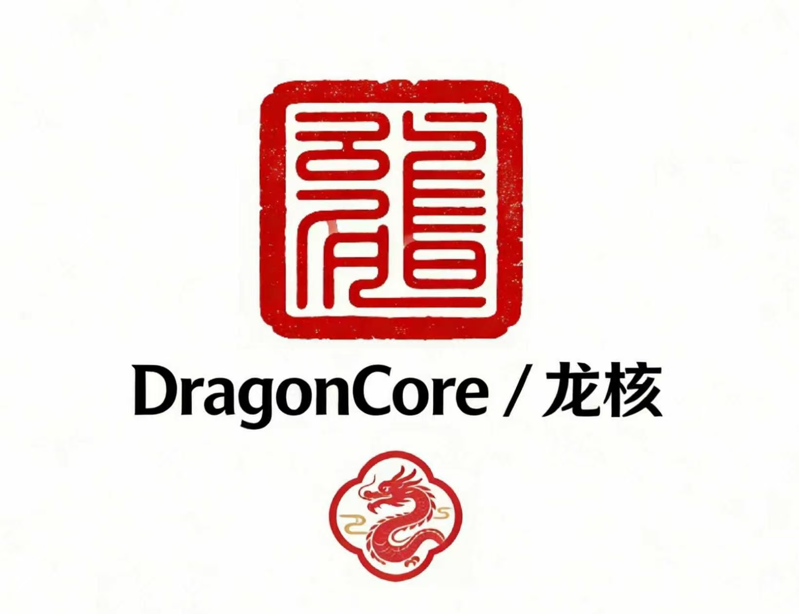

  
  
  # DragonCore 龙核
  
  **面向多智能体的治理优先操作系统**
  
  **Governance-First Operating System for Multi-Agent AI**
  
  *真龙，不是龙虾。*  
  *True Dragon. Not Claw.*
  
  [🌐 English Version](README_EN.md)

---

## 为什么是龙

在英文里，**lobster** 就只是 *lobster*。

但在中文里，龙虾这个词写作 **龙虾**：**龙** (dragon) + **虾** (shrimp)。

这创造了一个关键的区别：
**龙虾借用了龙的名字，而 DragonCore 建立在龙真正代表的东西之上。**

| 龙象征 | DragonCore 的实现 |
|--------|------------------|
| 有序 / Order | 三省六部治理架构 |
| 合法性 / Legitimacy | 可追溯的权威，终局裁决 |
| 协调 / Coordination | 多智能体协商，非混乱竞争 |
| 连续性 / Continuity | 归档、传承、文明记忆 |
| 适应性 / Adaptability | 升级、回滚、可执行恢复 |

当今大多数多智能体系统像**龙虾**一样构建：扁平、工具导向、没有清晰的权威链条。

DragonCore 像**龙**一样构建：受治理的、分层的、可追溯的、可审计的。

---

## DragonCore 解决什么

DragonCore 是一个面向多智能体 AI 系统的生产级治理内核。

**核心能力：**
- **19席治理核心**：冻结的权威结构（北斗七星 + 四象 + 八仙护法）
- **进程隔离**：基于 tmux 的多智能体真并行
- **干净执行**：Git worktree 环境，确保无状态、可复现的运行
- **生产账本化**：每次运行都被追踪、归档、可审计

**已验证机制：**
- ✅ 否决 / 冲突解决 / 升级
- ✅ 回滚 / 归档 / 终止
- ✅ 真实外部输入处理
- ✅ 17+ 生产轮次验证

**运行时源代码**: [`runtime/`](runtime/) — 完整的 Rust 实现，干净的重新构建

---

## 与 OpenClaw 对比 | Comparison

| 维度 | DragonCore (龙核) | OpenClaw |
|------|------------------|----------|
| **核心语言** | Rust (零成本抽象) | Python (解释执行) |
| **内存占用** | ~15-30 MB | ~150-300 MB |
| **启动速度** | < 50ms | ~500ms-2s |
| **并发模型** | 真并行 (tmux 多进程) | 伪并发 (asyncio 协程) |
| **进程隔离** | ✅ 独立 tmux 会话 | ❌ 单进程共享内存 |
| **执行环境** | ✅ Git worktree 隔离 | ❌ 需手动管理状态 |
| **治理架构** | 19席华夏治理 (三省六部) | 西方扁平议会模式 |
| **否决机制** | ✅ 多层级否决链 | ⚠️ 有限或无 |
| **归档系统** | ✅ 完整运行归档 | ❌ 无 |
| **终止机制** | ✅ 正式终止协议 | ❌ 无 |

### 核心差异详解

**1. 运行时性能**
- DragonCore 使用 Rust 编写的运行时，内存占用比 Python 版本减少 **80-90%**
- 冷启动时间 < 50ms，比 Python 快 **10-40 倍**
- 无 GIL 限制，真正的多核并行执行

**2. 多 Agent 并发**
- DragonCore: 每个 Agent 运行在独立的 tmux 窗口，**真并行**，可同时监控
- OpenClaw: 单进程内协程切换，**伪并发**，一个阻塞可能影响整体

**3. 治理深度**
- DragonCore: 19席权力制衡，否决、升级、回滚、归档、终止均为**正式机制**
- OpenClaw: 工具导向，缺乏系统性的**权力分离与问责机制**

---

## 为什么是 19

19 是**最小可治理核心**（Minimum Governable Core）。

- **18 席**：权威塌缩（有人自我批准）
- **20 席**：协调成本超过收益（仪式替代控制）
- **19 席**：治理仍有可能的冻结阈值

这 19 席**不是装饰性人格**。它们是具有明确权威边界的治理单元。

### 三层结构

| 层级 | 席位 | 职能 |
|------|------|------|
| **北斗七星** Seven Northern Stars | 7 | 核心治理（CEO/CTO/COO/CRO 等，权力分离） |
| **四象** Four Symbols | 4 | 战役层（探索、验证、叙事、稳定） |
| **八仙护法** Eight Guardians | 8 | 专项职能（审计、质量、快速部署、终止） |

**关键约束**：执行部门可以自由扩展（司/局/台/阁）。19席权威核心保持冻结。

---

## 核心部门

席位持有权力，部门执行工作。

| 部门 | 职能 | 为何必需 |
|------|------|----------|
| **工程部** | 实现与技术交付 | 没有它，什么也建不成 |
| **审计部** | 独立审查与问责 | 没有它，自我批准取代治理 |
| **风控部** | 风险检测与门禁 | 没有它，坏输出走得太远 |
| **监控部** | 运行时可见性 | 没有它，失败发现得太晚 |
| **平台部** | 编排与基础设施协调 | 没有它，执行碎片化 |
| **档案部** | 证据保存 | 没有它，没有制度记忆 |

---

## 开发与验证状态

DragonCore Runtime 已完成单路径部分验证，真实 API 驱动下的席位执行、tmux 隔离与 worktree 隔离已获证明。

| 组件 | 代码状态 | 运行验证 | 文档 |
|------|----------|----------|------|
| 19席治理协议 | ✅ 已实现 | ✅ 已验证 (单路径) | ✅ 完整 |
| 席位执行 (RV-003) | ✅ 已实现 | ✅ 已验证 (真实API响应) | ✅ 完整 |
| tmux 进程隔离 (RV-006) | ✅ 已实现 | ✅ 已验证 (20窗口) | ✅ 完整 |
| Git worktree 隔离 (RV-007) | ✅ 已实现 | ✅ 已验证 (独立worktree) | ✅ 完整 |
| 否决链 (RV-004) | ✅ 已实现 | ⏳ 待验证 | ✅ 完整 |
| 生产账本 (RV-005) | ✅ 已实现 | ⏳ 待验证 | ✅ 完整 |
| 终局裁决 (RV-008) | ✅ 已实现 | ⏳ 待验证 | ✅ 完整 |
| CLI 接口 | ✅ 已实现 | ✅ 编译通过 | ✅ 完整 |

**验证进度**: 5/10 verified | real API path proven | governance closure pending

**验证文档**:
- [`runtime/VERIFICATION_REPORT.md`](runtime/VERIFICATION_REPORT.md) - 详细验证状态
- [`runtime/VERIFICATION_CHECKLIST.md`](runtime/VERIFICATION_CHECKLIST.md) - 验证清单 (5/10完成)
- [`runtime/VERIFICATION_RESULTS.md`](runtime/VERIFICATION_RESULTS.md) - 真实API验证结果
- [`runtime/KNOWN_GAPS.md`](runtime/KNOWN_GAPS.md) - 已知缺陷

**Verified with real Kimi API-backed execution. Confirmed working in single-path validation.**

**DragonCore Runtime is not presented as production-ready. It is presented as an auditable implementation with real API-backed partial verification entering governance closure testing.**

---

## 治理原则

> **权力必须明确。**  
> **执行不得自我批准。**  
> **决策必须可追溯。**  
> **挑战必须正式，不是修辞。**  
> **回滚必须可执行。**  
> **归档必须可索引。**  
> **终止必须明确。**  
> **生产行为必须账本化。**  
> **治理必须强于便利。**

---

## 延伸阅读

| 文档 | 内容 |
|------|------|
| [`docs/USAGE_GUIDE.md`](docs/USAGE_GUIDE.md) | 完整使用指南、安装、配置、工作流 |
| [`docs/19_SEATS.md`](docs/19_SEATS.md) | 19席完整权威定义、权力驱动、冲突网络 |
| [`docs/HUAXIA_REGISTRY.md`](docs/HUAXIA_REGISTRY.md) | 30+ 神话/历史人物，用于二级机构 |
| [`runtime/`](runtime/) | DragonCore 运行时源代码、构建指南 |
| [`runtime/examples/`](runtime/examples/) | 治理场景示例、测试脚本 |
| [`docs/PRODUCTION_STATUS.md`](docs/PRODUCTION_STATUS.md) | 生产证据、运行账本、稳定性指标 |

---

## 许可证

MIT — 我们开源治理框架。  
华夏文明隐喻归我们所有。

**真龙，不是龙虾。**  
**True Dragon. Not Claw.**

